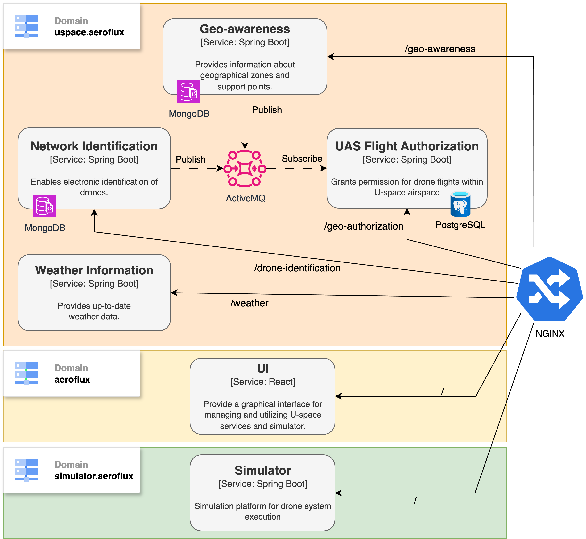

# AeroFlux UAV Simulator

AeroFlux UAV Simulator is a simulator for autonomous drones, focused on complex urban environments and compliance with European regulations. It supports generic missions using real-world coordinates and satellite maps, integrating a MAPE-K cycle for dynamic adaptation to environmental conditions and flight constraints. The simulator emphasizes strategic and decision-making aspects, introducing uncertainty factors such as changing weather, urban air traffic, and regulated geo-zones. Traffic management is decentralized, with drones adopting collaborative strategies to ensure safety and efficiency.

## Key Features

* **U-space Management**: Full implementation of U-space services for UAV traffic management
* **Microservices Architecture**: Distributed and scalable system with Docker containers
* **UAV Simulation**: Integrated simulator for testing and validating operations
* **Web Interface**: Interactive dashboard for management and monitoring
* **Geo-zone Management**: Definition and control of restricted geographical areas
* **Dynamic Authorization**: Automated rule-based authorization system

## System Architecture

The system consists of the following microservices:

* **Geo-Awareness**: Management of geo-zones and 3D spatial representation
* **Geo-Authorization**: Authorization system for access to controlled zones
* **Drone-Identification**: Registration and identification of drones
* **Weather**: Weather service for flight conditions
* **Simulator**: UAV simulator with autonomous logic
* **UI**: Web interface for management and monitoring



### Infrastructure Services

* **ActiveMQ**: Message broker for asynchronous communication
* **MongoDB**: Database for geo-awareness and drone-identification
* **PostgreSQL**: Database for geo-authorization
* **Nginx**: Reverse proxy and ingress controller

## Quick Start

### Prerequisites

* Docker & Docker Compose
* Available ports: 80, 5000, 8080–8085, 8161

### Starting the System

1. **Clone the repository**

   ```bash
   git clone https://github.com/alegil0206/AeroFlux.git
   cd AeroFlux
   ```

2. **Configure environment variables**

   ```bash
   cp .env.example .env
   # Edit the .env file with your configurations
   ```

3. **Edit the hosts file**

   Add the following line to your `/etc/hosts` file (Linux/Mac) or `C:\Windows\System32\drivers\etc\hosts` (Windows):

   ```
   127.0.0.1   aeroflux
   127.0.0.1   simulator.aeroflux
   127.0.0.1   uspace.aeroflux
   ```

4. **Start all services**

   ```bash
   docker-compose up -d
   ```

5. **Check the status of services**

   ```bash
   docker-compose ps
   ```

### Interface Access

* **Main Dashboard**: [http://aeroflux](http://aeroflux) (port 80)

### API Endpoints

* **Geo-Awareness**: [http://uspace.aeroflux/geo-awareness](http://uspace.aeroflux/geo-awareness)
* **Geo-Authorization**: [http://uspace.aeroflux/geo-authorization](http://uspace.aeroflux/geo-authorization)
* **Drone-Identification**: [http://uspace.aeroflux/drone-identification](http://uspace.aeroflux/drone-identification)
* **Weather**: [http://uspace.aeroflux/weather](http://uspace.aeroflux/weather)
* **Simulator**: [http://simulator.aeroflux](http://simulator.aeroflux)

## Project Structure

```
AeroFlux/
├── docker-compose.yml          # Service orchestration
├── nginx.template.conf         # Reverse proxy configuration
├── drone-identification/       # Drone identification service
├── geo-authorization/          # Authorization service
├── geo-awareness/              # Geo-zone management service
├── weather/                    # Weather service
├── simulator/                  # UAV simulator
├── ui/                         # React web interface
└── documentation/              # Documentation
```

### Technologies Used

* **Backend**: Spring Boot, Java 17
* **Frontend**: React, Vite, JavaScript
* **Database**: MongoDB, PostgreSQL
* **Message Broker**: ActiveMQ
* **Containerization**: Docker, Docker Compose
* **Web Server**: Nginx

## License

This project is licensed under the Apache License 2.0 – see the [LICENSE](LICENSE) file for details.
